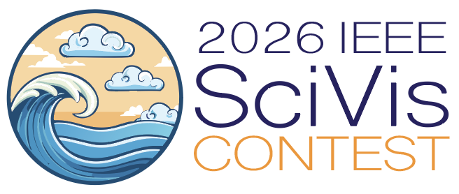

# 2026 IEEE SciVis Contest

Visit the official contest website: [2026 IEEE SciVis Contest](https://sciviscontest2026.github.io/)

---

## About the Contest

The IEEE SciVis Contest is an annual event that challenges participants to apply state-of-the-art visualization techniques to real-world scientific datasets. The 2026 contest features new datasets and tasks designed to push the boundaries of scientific visualization and data analysis.
**The best submission will win a cash prize of $1000.**

## Using the NSDF-OpenVISUS Cookbook

Participants are encouraged to use the NSDF-OpenVISUS Cookbook as a practical guide for:

- **Data Access:** Learn how to efficiently access and manage large scientific datasets using hierarchical Z-order storage and OpenVISUS tools.
- **Visualization Workflows:** Explore example workflows for atmospheric and ocean datasets, including multi-resolution visualization and interactive analysis.
- **Testing and Validation:** Follow best practices for testing your visualization approaches and validating results using the provided templates and utilities.

The cookbook provides step-by-step instructions, code snippets, and explanations to help you get started quickly and make the most of the contest datasets.

## Getting Started

1. Review the contest datasets and requirements on the [official website](https://sciviscontest2026.github.io/).
2. Use the NSDF-OpenVISUS Cookbook to learn about data access, visualization, and analysis techniques.
3. Adapt the example workflows and templates to your own contest entry.
4. Test your results and share your findings with the SciVis community!

---

For questions or support, please refer to the contest website or reach out to the NSDF-OpenVISUS Cookbook maintainers.

---

## Express Your Interest

If you are interested in participating, please fill out the form below:

<iframe src="https://docs.google.com/forms/d/e/1FAIpQLSePdqXxnqrAsUCAkVS2OfgkJ_aDZD61mYIBKGeS-RAK2olWdA/viewform?embedded=true" width="640" height="1534" frameborder="0" marginheight="0" marginwidth="0">Loading…</iframe>
